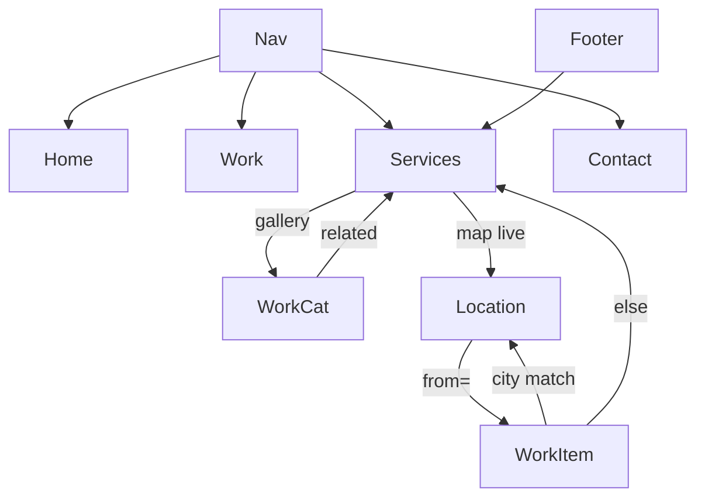

# Local-service Next.js IA — reference

Companion to `SKILL.md`. Use when scaffolding or auditing a site.

**No blog/journal** in this template. Do not add editorial routes unless requested.

---

## Site config worksheet

Fill before building routes:

```
Brand / SITE_NAME:
Canonical production URL:
Primary city:
Primary region / market:
Primary state (full + abbr):
Service area towns (list):
Work path prefix: /portfolio | /work | /gallery
Primary conversion path: /contact
Main offering (drives Location Hubs + map):
Location URL pattern: /{city}-{region}-{service-slug}
```

Suggested `siteConfig` exports:

- `CANONICAL_SITE_URL`, `getSiteUrl()`
- `SITE_NAME`, place constants, `SERVICE_AREAS`
- Per live hub: `*_PATH`, `*_TITLE`, `*_TITLE_SHORT`

---

## Route skeleton

```
/                                 Home
/contact                          Contact
/services/[serviceSlug]           Primary Service landings
/{city}-{region}-{service}        Location Hub (live cities only)
/{work}                           Work index
/{work}/[categorySlug]            Work category
/{work}/[categorySlug]/[itemSlug] Work item
/sitemap.ts  /robots.ts           SEO plumbing
```

### Redirect hygiene

| Pattern | Action |
|---------|--------|
| Old location URL | 301 → new Location Hub path |
| Retired pricing / FAQ / experience | 301 → Contact or main Primary Service |
| Legacy querystring Work URLs | Internal `redirect()` to canonical path |

### Sitemap

Include: Home, Contact, all Primary Services, Work index + categories + items, **live** Location Hubs.  
Exclude: `soon` location stubs, redirected legacy paths.

---

## Linking graph



### Surface checklist

| Surface | Links to |
|---------|----------|
| Nav | Home, Work, Services dropdown, Contact |
| Footer | Primary Services (+ optional Contact) |
| Service page | Work category, Location map (main offering), Contact CTA |
| Work category | Matching Primary Service |
| Work item | Primary Service **or** live Location Hub if city matches |
| Location Hub | Featured Work items (`?from=`), Contact |

### Work ↔ Location matching

Prefer longest-id / prefix match on item slug vs location `id`  
(e.g. `lake-city-…` before `lake`). Only when location `status === 'live'`.

---

## Metadata recipes

### Root layout

```ts
title: {
  default: `${PrimaryIntent} in ${City}, ${Abbr} … | ${SITE_NAME}`,
  template: `%s | ${SITE_NAME}`,
}
metadataBase: new URL(getSiteUrl())
alternates: { canonical: '/' } // home only at root; children override
```

### By page type

| Page | `title` | Canonical |
|------|---------|-----------|
| Home | default (absolute-equivalent) | `/` |
| Contact | `absolute: 'Contact … \| Brand'` | `/contact` |
| Primary Service | `absolute: service.metaTitle` | `/services/{slug}` |
| Location Hub | `absolute: '{City}, {State} {Service} \| Brand'` | hub path |
| Work index | `absolute: '… Portfolio/Work … \| Brand'` | `/{work}` |
| Work category | relative: `'{Category} Gallery'` | category path |
| Work item | relative: item title | item path |

### Open Graph

- Set `openGraph.title` / `description` / `url` per page
- Default OG image + alt from site config

---

## Heading recipes

### Shared chrome

```
[eyebrow p]
[H1]
[supporting paragraph]
[CTA]
```

### Primary Service sections (order suggestion)

1. Hero — H1 story headline + accent; Contact CTA  
2. Related Work — H2; item cards H3  
3. Locations (main offering only) — H2; map + list  
4. FAQ — H2; questions in `<summary>`  
5. Testimonials — H2 (omit section if empty)  
6. Bottom CTA — Contact  

### Location Hub sections

1. H1 — `{City}, {State} {Primary Service}`  
2. H2 — Why this market / approach  
3. H2 — Local venues or landmarks; venue names H3  
4. H2 — CTA / Contact  

### Work

| Page | H1 | H3 |
|------|----|----|
| Index | Editorial line | Category names |
| Category | Category name | Item titles |
| Item | Item title | — |

---

## Data module shapes (TypeScript sketches)

### Primary Service

```ts
type ServiceDef = {
  slug: string;
  name: string;          // display / nav long
  navLabel: string;      // short nav/footer
  workCategory: string;  // key into Work registry
  eyebrow: string;
  headline: string;
  headlineAccent: string;
  intro: string;
  body: string;
  faqs: { question: string; answer: string }[];
  ctaHeadline: string;
  ctaButton: string;
  metaTitle: string;           // absolute-ready
  metaDescription: string;
};
```

### Location

```ts
type LocationDef = {
  id: string;             // slug key for matching Work items
  city: string;
  path: string;           // canonical Location Hub URL
  status: 'live' | 'soon';
  x: number;              // map % if using SVG/map UI
  y: number;
  featured?: boolean;
};
```

---

## Implementation map (App Router)

| Concern | Typical files |
|---------|----------------|
| Globals | `src/lib/siteConfig.ts`, `src/app/layout.tsx` |
| Services | `src/lib/servicesData.ts`, `src/app/services/[serviceSlug]/page.tsx` |
| Work | `src/lib/workData.ts` (or portfolio*), `src/app/{work}/**` |
| Locations | `src/lib/locations.ts`, hub `page.tsx` |
| Cross-links | Related-links component, map component |
| Nav/Footer | Shared link list from service defs (avoid FS imports in client) |
| SEO | `sitemap.ts`, `robots.ts`, page-level JSON-LD as needed |

---

## Audit checklist (existing site)

- [ ] One H1 per indexable page  
- [ ] Absolute vs relative titles match recipe  
- [ ] Every indexable URL has matching canonical  
- [ ] Sitemap = live URLs only  
- [ ] Legacy paths 301  
- [ ] Service ↔ Work bidirectional links  
- [ ] Live locations linked from map + Work where relevant  
- [ ] Contact reachable from Home, Services, Location, proof CTAs  
- [ ] No blog/journal routes unless explicitly requested  
- [ ] No `fs` helpers pulled into client components  

---

## Origin note

Pattern extracted from a local-service Next.js site (services + work/gallery + city hub + contact). Blog/journal from the source site is **intentionally omitted** here. Reuse the **architecture**, not the niche copy or service list.
